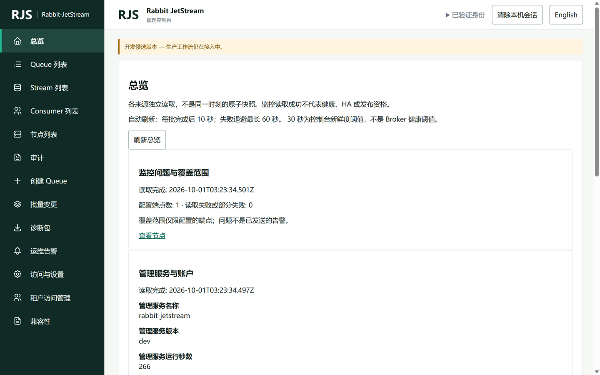
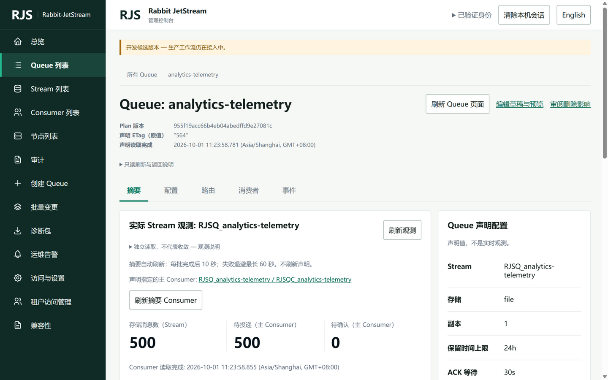
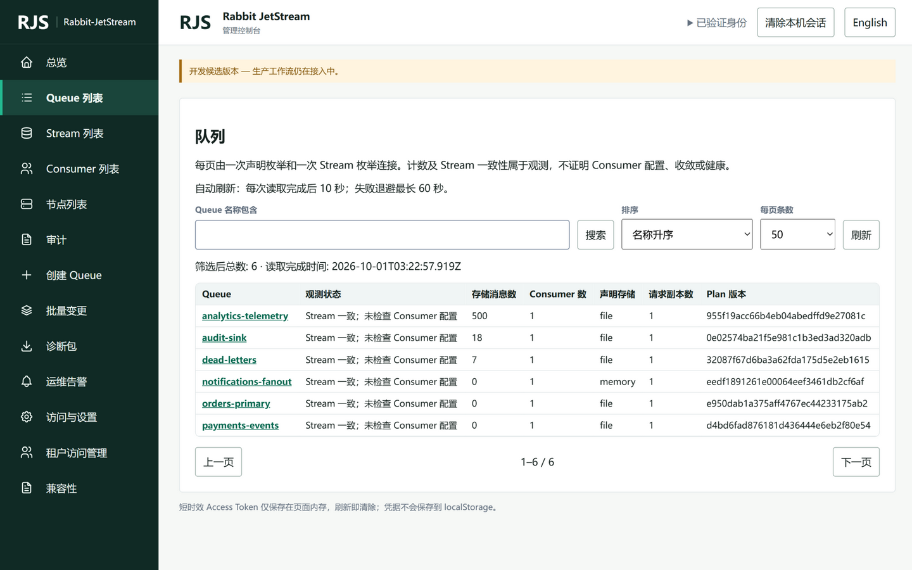
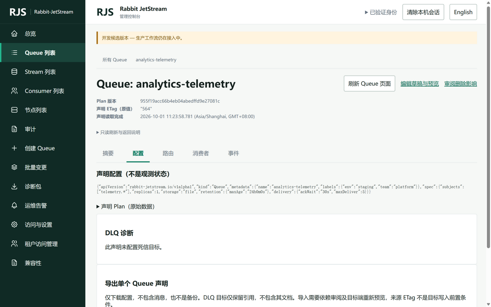

# 管理控制台产品评审（PM Review）

[English](design-review.md) | [简体中文](design-review.zh-CN.md)

状态：评审完成，待 owner 排期 · 评审日期：2026-10-01
评审对象：`admin-ui/dist/`（已提交的嵌入式候选，由本地构建的 `rjs-management` 直接提供服务）
评审方法：本地真实服务 + Chromium 交互走查。启动本地 JetStream（NATS）与管理服务，通过 API 预置 6 个 Queue 与消费数据，以本地账户登录后逐页人工走查（桌面 1440×900、移动 375×812、中/英双语），全部结论来自真实渲染页面，截图见 [design-review-screens/](design-review-screens/)。复现环境见[附录](#附录评审环境与复现)。

---

## 1. 总体结论

**工程候选的"正确性"做到了，"产品化"没做到。** 控制台把"观测与声明的语义诚实"执行得很彻底，双语和无障碍也超出内部工具的平均水准；但它目前读起来像一套**面向系统作者本人的验收界面**，而不是面向值班运营、平台管理员和审计员的日常工具。用户打开总览页得到的是三屏免责声明，而不是"系统现在健康吗、哪里最需要我"。

分维度评价（5 分制）：

| 维度 | 评分 | 一句话 |
|---|---|---|
| 功能覆盖度 | 4.0 | 读路径完整，写路径有预览-确认闭环 |
| 双语与无障碍 | 4.5 | 中英结构对齐、焦点/aria 投入真实可见 |
| 信息架构 | 2.0 | 13 个一级导航平铺，动作与资源混杂 |
| 视觉设计 | 2.0 | 有干净的骨架，无层级、无状态语义、无品牌感 |
| 数据可视化与决策支持 | 1.5 | 几乎零图形，关键数字无强调、无阈值 |
| 文案与用户沟通 | 2.0 | 免责声明文化和工程术语把证据边界转嫁给用户 |
| 交互效率 | 2.5 | 刷新即掉登录、详情页操作权重倒置 |
| 稳定性（本次实测） | 2.0 | 发现一个可击溃整个管理进程的 P0 崩溃 |

**综合：3.0 / 5。** 底子（token 纪律、双语、语义模型）值得保留，但若以"交付给真实运营团队"为标准，当前状态会伤害第一印象与日常信任。

---

## 2. 用户与核心任务（评审基准）

评审以三类目标用户的"最常见问题"为基准，逐页检查控制台能否在 30 秒内回答：

| 用户 | 高频问题 | 当前能否回答 |
|---|---|---|
| 值班运营 | 系统健康吗？哪个队列积压最重？ | ❌ 总览无积压排行/健康分区；500 条待投递无任何视觉强调 |
| 平台管理员 | 谁改了什么？现在谁有权限？ | ⚠️ 审计可用但筛选门槛高；权限列表是英文原始权限码 |
| 审计员 | 变更是否走完预览-确认？证据在哪？ | ⚠️ 证据链理念好，但入口是纯文本链接，可发现性差 |

---

## 3. 关键发现

分级：**P0** 阻断信任/可用性，**P1** 显著伤害日常体验，**P2** 打磨项。

### P0-1 未配置 Prometheus 时，告警监控路径可击溃整个管理进程

- **现象**：在未设置 `RJS_PROMETHEUS_URL` 的部署中，本地登录并正常浏览数分钟后，管理服务进程因空指针崩溃退出（panic 栈：`prometheus.(*Client).AlertRules` ← `api.watchAlerts`，`management/internal/api/events.go:227`）。控制台所有页面随之不可用。
- **PM 影响**：这不是"丑"，是**可靠性缺陷**。"运维告警"是主导航功能，未配置其依赖时不应有能力杀死控制平面本身。运营对控制台的第一信任来自"它永远在"。
- **建议**：`AlertRules` 增加接收者 nil guard（未配置时返回"不支持"错误）；并补充一条失败路径测试：无 Prometheus 配置 + 告警 watcher 运行 + SSE 订阅，断言进程存活。
- 复现与佐证见[附录](#附录评审环境与复现)。

### P1-1 总览页没有总览价值：无健康分区、无积压排行、无趋势



- **现象**：总览页由三段纯文本卡片组成（"监控问题与覆盖范围"、"管理服务与账户"、"已声明 Queue"），核心信息只有"配置端点数: 1"、"已声明 Queue 总数: 6"、"账户存储使用（字节）64713"。三屏内容，零图形，零排序，零下钻联动。
- **PM 影响**：值班运营打开第一屏得不到任何"要不要担心"的信号。字节数未做人类可读转换（64.7 KB 被展示为"64713"）。
- **建议**：总览改为驾驶舱结构：顶部健康摘要条（端点/Queue/Consumer 三组数字 + 状态色）；"待投递 Top 5 队列"列表直接链接详情；存储等数值人性化（64.7 KB）；免责声明收纳进 info tooltip。

### P1-2 关键状态与积压没有任何视觉语义



- **现象**：Queue 摘要里"待投递（主 Consumer）500"以与"待确认 0"完全相同的样式展示；列表页"观测状态"列每行重复同样长的纯文本"Stream 一致；未检查 Consumer 配置"；节点页"监控读取成功"同为纯文本。全站没有状态徽章、没有色彩语义（绿/琥珀/红仅在免责横幅上出现过琥珀色）。
- **PM 影响**：500 条积压和 0 条积压在视觉上等价，等于把"判断"还给用户。运营工具的核心价值就是把状态翻译成优先级。
- **建议**：为"观测状态""读取状态""告警"引入三档状态徽章（token 层已有色板）；待投递超阈值用警示色 + 数值加粗；"Stream 一致；未检查 Consumer 配置"拆成徽章（一致 ✓）+ 次要说明（Consumer 未检查）。

### P1-3 信息架构：13 个一级导航平铺，动作与资源混杂

- **现象**：主导航为"总览 / Queue 列表 / Stream 列表 / Consumer 列表 / 节点列表 / 审计 / 创建 Queue / 批量变更 / 诊断包 / 运维告警 / 访问与设置 / 租户访问管理 / 兼容性"，13 项无分组。"创建 Queue"（一个动作）与"Queue 列表"（一个资源）并列；"兼容性"（构建元数据，开发者向）与核心运营资源同级。
- **PM 影响**：导航是最先被用户内化的心智模型。动作混在资源里会让人找"编辑/创建"时先扫一遍侧栏；开发者页面混在运营页面里稀释专业感。
- **建议**：分组，例如：
  - **资源**：总览 / Queues / Streams / Consumers / 节点
  - **运维**：告警 / 诊断包 / 审计
  - **治理**：批量变更 / 租户访问管理 / 访问与设置
  - "创建 Queue"移入 Queue 列表页头主按钮；"兼容性"降级到设置页或页脚链接。

### P1-4 整页刷新即掉登录，且刷新偏好与登录状态体验不一致

- **现象**：Access Token 仅存内存（安全设计），任何整页刷新（F5、分享链接打开）都回到登录页要求重新输入用户名密码；语言和刷新偏好却保存在本地。
- **PM 影响**：值班场景中"刷新一下"是高频动作，付出"重新登录"的代价会让用户避免刷新、进而依赖过期数据——这恰恰与控制台"新鲜度优先"的理念相反。
- **建议**：保留 token 不落盘的前提下，提供安全折中：刷新后展示"会话已失效，一键使用本页凭据重新验证"（用户在页面内重输一次密码的静默恢复）；或提供可关闭的"记住用户名（仅本机）"。至少要在产品层面承认这个代价，而不是让用户自己发现。

### P1-5 免责声明文化：把系统内部的证据边界转嫁给用户



- **现象**：几乎每页顶部都有 1–3 条否定句式说明，如"每页由一次声明枚举和一次 Stream 枚举连接。计数及 Stream 一致性属于观测，不证明 Consumer 配置、收敛或健康。""各来源独立读取，不是同一时刻的原子快照。""30 秒为控制台新鲜度阈值，不是 Broker 健康阈值。"另有"自动刷新：每次读取完成后 10 秒；失败退避最长 60 秒"这类实现细节。
- **PM 影响**：语义诚实的**理念**是对的（这也是本产品差异化价值），但表达方式让每页都以"我们可能不准"开场，削弱而不是建立信任。运营用户需要的是默认可信 + 需要时查证。
- **建议**：免责说明降级为折叠的"关于这些数字"tooltip 或页面底部小字；"自动刷新 10 秒"改成状态指示器（如"刷新于 11:23:58 · 10s 自动"）；真正需要警示的场景（数据陈旧、部分失败）用页面内琥珀条表达。

### P1-6 Queue"配置"Tab 是一行 JSON dump，声明与观测的差异没有可视化



- **现象**：配置 Tab 主体是一行不可折叠的紧凑 JSON（`{"apiVersion":"rabbit-jetstream.io/v1alpha1",...}`），旁有折叠的"声明 Plan（原始数据）"。"声明 vs 观测"对比是这个控制台的核心价值主张，但没有任何页面提供结构化的差异视图。
- **PM 影响**：运营要回答"这个队列现在到底是怎么配的"只能读 JSON；"声明和实际一致吗"要自己在两个 Tab 之间心算。
- **建议**：配置 Tab 提供结构化键值表（存储/副本/保留/投递策略各一行）；摘要页提供"声明值 vs 观测值"并排两列，不一致处标色。原始 JSON 收进"原始数据"折叠区（现有 Plan 折叠区的模式很好，扩展即可）。

### P2 视觉与交互打磨清单

| # | 现象 | 证据 | 建议 |
|---|---|---|---|
| 1 | 32 位 Plan revision hash 直接出现在列表与详情页，英文界面 1440px 即撑出横向滚动条 | [03](design-review-screens/03-queue-list-en-hscroll.png)、[08](design-review-screens/08-queue-detail-config-json.png) | 截断为前 8 位 + 复制按钮；列宽治理，消除 1440px 溢出 |
| 2 | 登录页在未配置 SSO 的部署中固定显示红色"SSO 登录不可用或回调无效" | [01](design-review-screens/01-login.png) | 未配置 SSO 时不应渲染错误，最多渲染折叠的"SSO 登录不可用"说明 |
| 3 | 登录按钮、创建页"准备创建草稿"主 CTA 均为白底描边样式，与次要按钮无差别 | [01](design-review-screens/01-login.png)、[10](design-review-screens/10-queue-create.png) | 建立主/次按钮层级（实心主色 vs 描边） |
| 4 | 创建表单控件一律拉通 1300px 全宽，输入框与下拉视觉失重 | [10](design-review-screens/10-queue-create.png) | 表单控件宽度上限（约 480px），双列布局 |
| 5 | 侧栏与顶栏品牌重复：RJS / Rabbit JetStream / 管理控制台 各出现两遍 | [02](design-review-screens/02-queue-list.png) | 顶栏只保留页面上下文（面包屑+动作），品牌留给侧栏 |
| 6 | Queue 详情的"编辑草稿与预览""审批删除影响"是纯文本链接，主操作权重不足 | [06](design-review-screens/06-queue-detail-summary.png) | 详情页动作升级为按钮组（编辑=主按钮、删除=危险描边按钮） |
| 7 | 原生文件上传控件、原生 select、等宽权限码 bullet 直接暴露 | [11](design-review-screens/11-queue-create-import.png)、[19](design-review-screens/19-access-settings.png) | 统一自定义控件皮肤；权限码附人类可读说明 |
| 8 | 消费者筛选区：全宽输入+全宽"筛选消费者"按钮，5 个控件占一屏，数据只有一行 | [09](design-review-screens/09-queue-detail-consumers.png) | 筛选区收敛为单行工具栏 |
| 9 | 移动端 375px：品牌+身份+按钮占顶栏 108px，加横幅、导航、三行免责声明后内容首屏已到 800px | [22](design-review-screens/22-mobile-nav.png)、[23](design-review-screens/23-mobile-queue-list.png) | 移动端顶栏压缩为单行；横幅可关闭 |
| 10 | "已验证身份"以 ▶ 折叠 disclosure 呈现，而"清除本机会话"却是一级按钮——权重倒置 | [02](design-review-screens/02-queue-list.png) | 身份（用户名+租户）直接平铺展示；清除会话收进身份菜单 |
| 11 | Stream 列表仅两列（名称、消息数），KV_RJS_META 等系统 Stream 与业务 Stream 无区分标记 | [12](design-review-screens/12-stream-list.png) | 补充保留策略/副本/存储列；系统 Stream 加"内部"徽章 |
| 12 | 运维告警降级态只有一行红字，无下一步指引 | [17](design-review-screens/17-alerts-degraded.png) | 说明"管理员需配置 RJS_PROMETHEUS_URL"，附文档链接 |
| 13 | 租户访问管理"创建账户"的租户勾选框无可读标签（只有孤立的蓝色勾选框） | [20](design-review-screens/20-tenant-access.png) | 勾选框加"授予 local 租户成员资格"标签 |

---

## 4. 逐页走查记录

| 页面 | 首屏是否回答核心问题 | 主要观察 |
|---|---|---|
| 登录 | ✅ | 误导性 SSO 错误；主按钮无层级；大面空白（[01](design-review-screens/01-login.png)） |
| 总览 | ❌ | 三屏纯文本卡，无健康分区/积压排行/趋势；字节数未人性化（[04](design-review-screens/04-overview-top.png)、[05](design-review-screens/05-overview-bottom.png)） |
| Queue 列表 | ⚠️ 部分 | 观测状态列长文本重复；hash 全长展示；筛选区控件失重（[02](design-review-screens/02-queue-list.png)） |
| Queue 详情·摘要 | ⚠️ 部分 | 唯一有大数字的页面（好）；但积压无告警语义；动作是文本链接（[06](design-review-screens/06-queue-detail-summary.png)） |
| Queue 详情·配置 | ❌ | 单行 JSON dump（[08](design-review-screens/08-queue-detail-config-json.png)） |
| Queue 详情·消费者 | ⚠️ | 筛选区占一屏；按钮全宽（[09](design-review-screens/09-queue-detail-consumers.png)） |
| 创建 Queue | ❌ | 全宽控件；JSON 草稿编辑与表单混杂；两个文件上传区堆叠一页（[10](design-review-screens/10-queue-create.png)、[11](design-review-screens/11-queue-create-import.png)） |
| Stream 列表 | ⚠️ | 仅两列；系统 Stream 无标记；横向滚动条（[12](design-review-screens/12-stream-list.png)） |
| Stream 详情 | ❌ | 单列 label-value 堆叠，无网格无层级（[13](design-review-screens/13-stream-detail.png)） |
| Consumer 详情 | ⚠️ | 500 待投递无强调；单列堆叠（[14](design-review-screens/14-consumer-detail.png)） |
| 节点列表 | ⚠️ | 55 字符 Node ID 作链接文本；状态纯文本；下半页空白（[15](design-review-screens/15-node-list.png)） |
| 审计 | ❌ | 6 个全宽筛选控件 + RFC3339 手输说明；无时间快捷范围（近 1h/24h）（[16](design-review-screens/16-audit.png)） |
| 运维告警 | ❌ | 降级态一行红字无指引；页面 90% 空白（[17](design-review-screens/17-alerts-degraded.png)） |
| 批量变更 | ⚠️ | 整页只有一个上传行+免责声明（[18](design-review-screens/18-bulk-change.png)） |
| 访问与设置 | ⚠️ | 英文权限码原样 bullet；说明冗长（[19](design-review-screens/19-access-settings.png)） |
| 租户访问管理 | ⚠️ | 勾选框无标签；布局零散（[20](design-review-screens/20-tenant-access.png)） |
| 兼容性 | — | 构建元数据对运营无行动价值，建议降级入口（[21](design-review-screens/21-compatibility.png)） |
| 移动端 375 | ❌ | 顶栏+横幅+导航+免责声明挤占首屏；表格横向滚动（[22](design-review-screens/22-mobile-nav.png)、[23](design-review-screens/23-mobile-queue-list.png)） |

---

## 5. 应当保留的亮点

1. **双语工程**：中英覆盖完整、结构对齐、有测试保护，语言切换即时生效（实测）。
2. **语义诚实的理念**：区分"声明值"与"观测值"、不虚构健康——这是同类工具少见的差异化资产，问题只在表达方式。
3. **无障碍投入**：跳转正文链接、统一焦点环、表格 caption、aria-live 路由播报。
4. **Token 纪律**：颜色全部走 token 层、深色主题随系统、图标策略克制——为视觉升级留了干净的地基。
5. **写路径的预览-确认-条件写闭环**：草稿、服务端预览、ETag 冲突恢复，这是很多成熟消息平台控制台都没有的安全设计。
6. **降级不隐瞒**：历史指标不可用、告警不可用时明确报错（虽然文案生硬），不假装正常。

---

## 6. 建议路线图

### 快速胜利（1–2 周，不动架构）
1. 修复 P0-1 panic + 回归测试（半天）。
2. 状态徽章体系上线：观测状态、读取状态、告警三档色（token 已有色板）。
3. hash 截断 + 复制；字节人性化；表格 1440px 溢出治理。
4. 删减各页顶部免责声明为 tooltip；"自动刷新"改状态指示器。
5. 登录页 SSO 误导错误修复；主/次按钮层级样式。
6. 导航分组 + "创建 Queue"移入列表页头。

### 中期（1–2 月）
1. 总览驾驶舱改造（健康条 + 待投递 Top 5 + 趋势图，Prometheus 已有数据源）。
2. 声明 vs 观测并排对比视图（Queue 详情摘要）。
3. 表格列宽与响应式治理：移动端列表卡片化。
4. 会话刷新恢复流程（保持 token 不落盘的安全边界）。
5. 审计时间快捷范围 + 结构化筛选。

### 长期
1. 可自定义的监控看板与订阅（告警页从只读走向闭环）。
2. 面向租户的个性化首页；暗色主题手动开关。
3. 以"30 秒回答核心问题"为验收标准的整轮可用性测试（三类用户各 3 人）。

---

## 附录：评审环境与复现

```
# 构建与启动（Windows 本地实测）
cd upstream/nats-server && go build -o ../../bin/nats-server.exe .
go build -o bin/rjs-management.exe ./management/cmd/rjs-management
./bin/nats-server.exe -js -a 127.0.0.1 -p 4222 -m 8222 -sd <data-dir>

RJS_ADMIN_TOKEN=review-admin-token \
RJS_HTTP_ADDR=127.0.0.1:8223 \
RJS_LOCAL_ACCOUNTS_FILE=<accounts.json> \
RJS_LOCAL_AUTH_SIGNING_KEY=<key> \
./bin/rjs-management.exe
# 浏览器访问 http://127.0.0.1:8223/admin/
```

- 演示数据：通过 `PUT /api/v1/queues/{queue}`（`If-None-Match: *`）声明 6 个 Queue，NATS 发布约 700 条消息并创建 pull Consumer。
- P0-1 崩溃佐证：未设 `RJS_PROMETHEUS_URL` 启动服务，登录浏览数分钟后进程退出，日志含 `panic: runtime error: invalid memory address or nil pointer dereference`，栈顶 `management/internal/prometheus/alerts.go:49` 与 `management/internal/api/events.go:227`（watchAlerts）。设置 `RJS_PROMETHEUS_URL` 指向不可达地址后不再崩溃（走错误路径）。
- 截图清单：[design-review-screens/](design-review-screens/) 共 23 张，文件名与正文引用一一对应。

## 评审边界

- 本次为产品视角走查，不重复 `design-qa.md` 已覆盖的像素级保真检查，也不替代 axe/playwright 门禁。
- 未覆盖：集群多节点场景、OIDC/浏览器 SSO 流程、诊断包下载流程、批量变更完整执行流。这些建议在下一轮走查补充。
- 文中所有"建议"均为产品建议，涉及视觉规范变更时仍须遵循 [webui-selected-design.md](webui-selected-design.md) 与 `shell.css` token 纪律（新色须经视觉 QA 进入 token 层）。
